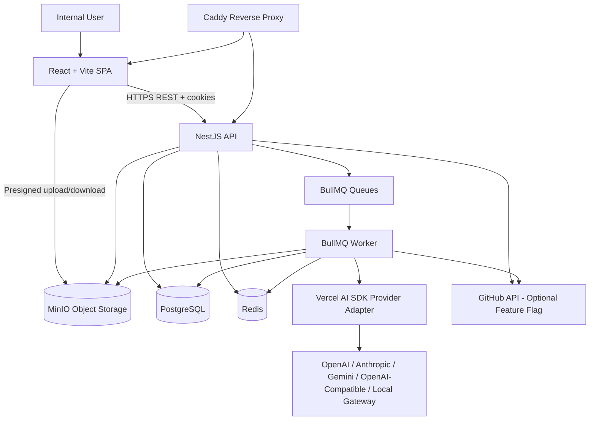
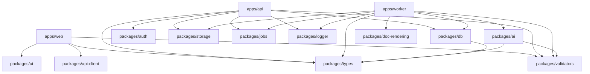
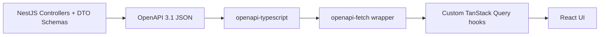
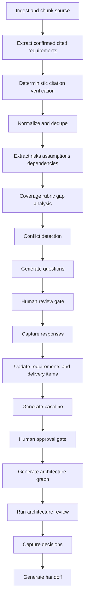
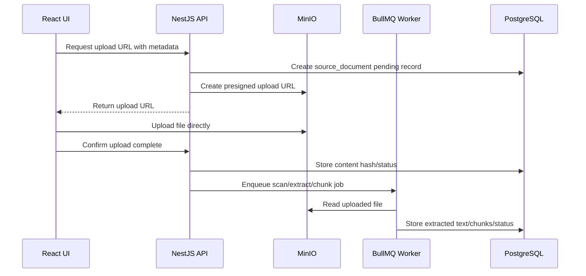

# AtlasHQ V1 Architecture and Tech Stack

## 1. Purpose

This document defines the Version 1 architecture and technology stack for **AtlasHQ**, an AI-assisted software delivery governance platform that converts messy client inputs into approved requirements, open questions, delivery risks, architecture decisions, and handoff-ready documentation.

It is based on the product plan in `docs/core/core-plan.md` and captures the concrete technical choices needed to build Version 1 without drifting into heavy project management, full client portals, deep execution tooling, or cloud-provider lock-in.

---

## 2. Architecture Decision Summary

### 2.1 Final V1 Architecture

AtlasHQ V1 will use a **self-hostable TypeScript modular monolith** with separated runtime processes:

| Runtime | Responsibility |
|---|---|
| `apps/web` | Authenticated browser UI built with React, Vite, and TanStack Router |
| `apps/api` | NestJS REST API, auth integration, authorization, domain services, orchestration endpoints |
| `apps/worker` | BullMQ workers for document processing, AI pipelines, exports, GitHub polling, and retryable jobs |
| PostgreSQL | Primary relational system of record |
| Redis | Queue backend, lightweight cache, rate-limit/session secondary storage |
| MinIO | Self-hosted S3-compatible object storage for source files and generated exports |
| Caddy | Reverse proxy, TLS termination, static UI serving, API routing |

### 2.2 Final Frontend Decision

Use:

> **React + Vite + TanStack Router**

Do not use `Next.js` or `TanStack Start` for V1.

Reason:

- AtlasHQ V1 is primarily an authenticated internal workspace.
- V1 does not need public SEO pages or SSR-heavy rendering.
- `NestJS` already owns backend responsibilities.
- Adding a UI server framework would duplicate server-side concerns.
- A Vite SPA keeps the UI lightweight, fast, and cleanly separated from the API.

`TanStack Start` can be reconsidered later only if V2/V3 introduces public client-facing pages, SEO-heavy content, or SSR requirements that cannot be handled by the NestJS API plus SPA.

### 2.3 Final AI Decision

Use:

> **Vercel AI SDK as the standard AI integration layer**

Important clarification:

- Vercel AI SDK does **not** require deploying to Vercel.
- Vercel AI SDK does **not** require Next.js.
- It can be used inside NestJS services and BullMQ workers.
- AtlasHQ will wrap it in `packages/ai` so domain modules do not depend directly on one model vendor.

The SDK handles model calls, streaming, and structured output support. AtlasHQ still owns citation verification, human review gates, AI run audit records, evaluation, cost tracking, and deterministic grounding checks.

---

## 3. Hard Constraints

| ID | Constraint | Architectural Impact |
|---|---|---|
| CON-001 | Do not use AWS or Azure managed services for V1 | Use self-hosted PostgreSQL, Redis, MinIO, Caddy, Docker Compose |
| CON-002 | Original source documents must be immutable | Object storage uses content hashes and source version records; no in-place overwrite |
| CON-003 | AI cannot silently invent scope | CONFIRMED items require citations and deterministic quote verification |
| CON-004 | Every major item must be traceable | Add generic `traceability_link` table from day one |
| CON-005 | V1 must stay lightweight | No sprint board, no full client portal, no full QA system, no financial analytics |
| CON-006 | Human review gates are mandatory | AI output cannot become approved scope without human action |
| CON-007 | No direct secret storage | Store only secret references in handoff docs; app secrets live in environment/secret manager outside AtlasHQ |
| CON-008 | PostgreSQL full-text search is enough for V1 | No pgvector/semantic search in V1 |
| CON-009 | No CRDT/multiplayer editor in V1 | Use soft locks, autosave, and version history |
| CON-010 | No automated crawling or login bypass for reference artifacts | Only human-provided artifacts and explicit one-page capture |

---

## 4. High-Level System Architecture



### 4.1 Runtime Responsibilities

| Component | Owns | Does Not Own |
|---|---|---|
| React SPA | UI, routing, client state, forms, document review UX | Business rules, authorization, AI orchestration, background jobs |
| NestJS API | Auth boundary, RBAC, domain logic, API contracts, orchestration, audit writes | Long-running AI/doc processing, file binary storage |
| BullMQ Worker | Retryable async work, AI pipelines, exports, citation checks, scheduled polling | User-facing request/response APIs |
| PostgreSQL | System-of-record data, versioning, traceability, audit, FTS | Large binary files |
| MinIO | Source documents, screenshots, generated PDFs/exports | Relational metadata or permissions |
| Redis | Queues, rate limits, short-lived cache/session secondary storage | Durable business records |

---

## 5. Repository and Monorepo Architecture

Use `pnpm` workspaces with Turborepo.

### 5.1 Proposed Structure

```text
atlashq/
  apps/
    web/                         # React + Vite + TanStack Router SPA
    api/                         # NestJS REST API
    worker/                      # BullMQ processors and scheduled jobs
  packages/
    api-client/                  # OpenAPI-generated types/client wrappers
    ai/                          # Vercel AI SDK wrapper, provider registry, prompt contracts
    auth/                        # Better Auth config helpers, session types, permission helpers
    config/                      # App-specific env validation schemas
    db/                          # Drizzle schema, migrations, db client
    doc-rendering/               # Markdown, HTML, PDF, export helpers
    jobs/                        # Queue names, job payload schemas, job utilities
    logger/                      # Pino logger setup and correlation IDs
    storage/                     # MinIO/S3-compatible storage abstraction
    types/                       # Shared domain types
    ui/                          # Shared presentational UI primitives if needed
    validators/                  # Shared Zod schemas and DTO validation
  docs/
    core/                        # Product plans
    architecture/                # Architecture and tech-stack decisions
    impl-plan/                   # Implementation plans if/when needed
```

### 5.2 Turborepo Rules

- Root `package.json` scripts should delegate to `turbo run` only.
- App/package-specific scripts must live inside each app/package.
- Do not chain package builds manually with `cd` or `&&`.
- Declare workspace dependencies explicitly using `workspace:*`.
- Avoid a single root `.env`; each app owns the env vars it needs.
- Put generated build outputs in Turbo task `outputs`.
- Prefer package boundaries over importing across folders by relative paths.

### 5.3 Package Dependency Direction



---

## 6. Final Technology Stack

### 6.1 Runtime and Language

| Area | Choice | Notes |
|---|---|---|
| Language | TypeScript | Shared across web, API, workers, schemas, AI contracts |
| Runtime | Node.js LTS | Pin with Volta, mise, or `.nvmrc` when implementation starts |
| Package manager | pnpm | Efficient workspace dependency management |
| Monorepo orchestrator | Turborepo | Build/test/lint orchestration and caching |
| Module format | ESM-first where practical | Aligns with modern tooling and Vercel AI SDK ecosystem |

### 6.2 Frontend

| Need | Choice | Reason |
|---|---|---|
| UI framework | React | Stable ecosystem for complex dashboards and editors |
| Build tool | Vite | Lightweight, fast dev server, simple static output |
| Routing | TanStack Router | Type-safe route definitions for SPA workflows |
| Server state | TanStack Query | Caching, background refetch, optimistic updates, polling |
| Tables/grids | TanStack Table | Requirement boards, trackers, source lists, audit tables |
| Virtualization | TanStack Virtual | Large requirements/source/audit lists |
| Forms | React Hook Form | Mature form state for complex review and metadata forms |
| Validation | Zod | Shared schemas with backend and AI output validation |
| Form resolver | `@hookform/resolvers` | Connects React Hook Form and Zod |
| Local UI state | Zustand | Small UI-only state such as panels, filters, wizards |
| Styling | Tailwind CSS | Fast and consistent product UI styling |
| Components | shadcn/ui + Radix UI | Accessible primitives with full code ownership |
| Icons | Lucide | Clean icon set compatible with shadcn style |
| Notifications | Sonner | Lightweight toast notifications |
| Command palette | cmdk | Fast navigation/actions for power users |
| Charts | Recharts | Basic dashboard charts and metrics |
| Rich text | Tiptap | Derived artifact editing: requirements, baselines, handoff sections |
| Markdown rendering | `react-markdown`, `remark-gfm`, `rehype-sanitize` | Safe preview for generated/exported content |
| Diagram rendering | Mermaid | Default architecture rendering format |
| Code/JSON editor | CodeMirror 6 | Architecture Graph JSON and Mermaid editing |
| Interactive diagrams | React Flow + ELK/Dagre | Fast-follow for graph canvas, not V1 source of truth |
| Upload UI | Uppy | Robust upload flows with progress and metadata |
| PDF preview | `react-pdf` / `pdfjs-dist` | Source document preview in browser |
| Testing | Vitest, Testing Library, MSW, Playwright | Unit, component, API-mocked, E2E coverage |

### 6.3 Backend API

| Need | Choice | Reason |
|---|---|---|
| Framework | NestJS | Modular domain architecture, DI, guards, interceptors, workers integration |
| API style | REST | Clear contracts and easier external integration |
| API contract | OpenAPI 3.1 | Documentation, typed client generation, API validation |
| OpenAPI tooling | `@nestjs/swagger`, `openapi-typescript`, `openapi-fetch` | Generate docs/types/client from API contract |
| ORM | Drizzle ORM | Type-safe SQL with control over PostgreSQL features |
| DB driver | `pg` | PostgreSQL client for Node.js |
| Validation | Zod | Shared validation and AI schema contracts |
| Auth | Better Auth | Sessions, email/password, future plugins |
| Authorization | Project-scoped RBAC + custom/CASL policy layer | Project Membership is the real access boundary |
| Logging | Pino | Structured logs, correlation IDs |
| Rate limiting | Redis-backed limits | Auth/API abuse protection |
| API tests | Supertest + Testcontainers | Real integration tests against Postgres/Redis/MinIO |

### 6.4 Database and Storage

| Need | Choice | Reason |
|---|---|---|
| Primary DB | PostgreSQL | Strong relational model, traceability, transactions, JSONB |
| Search | PostgreSQL full-text search | Enough for V1; avoids vector/semantic complexity |
| Useful extensions | `pg_trgm`, `unaccent` | Better text search and fuzzy matching |
| JSON fields | JSONB | Delivery item attributes, AI output snapshots, architecture graph model |
| Migrations | Drizzle Kit | Version-controlled schema migration |
| Object storage | MinIO | Self-hosted S3-compatible storage, no AWS/Azure dependency |
| File SDK | S3-compatible client | Keeps future object storage portable |
| Content integrity | SHA-256 content hashes | Immutable source and snapshot verification |
| Malware scanning | ClamAV | Upload safety baseline |

### 6.5 Background Jobs and Async Processing

| Need | Choice | Reason |
|---|---|---|
| Queue | BullMQ | Reliable Node.js job queue with retries, delayed jobs, workers |
| Queue backend | Redis | Required for BullMQ; also useful for rate limits/session secondary storage |
| Job dashboard | Bull Board or equivalent | Internal inspection of AI/document/export jobs |
| Retry model | Idempotent job handlers | Safe retries for AI, exports, citation verification, polling |
| Scheduling | BullMQ repeatable jobs | GitHub polling, cleanup, reprocessing checks |

### 6.6 AI Layer

| Need | Choice | Reason |
|---|---|---|
| AI SDK | Vercel AI SDK | Unified provider abstraction and structured output patterns |
| SDK package location | `packages/ai` | Keeps AI vendors isolated from domain code |
| Structured extraction | `generateObject` + Zod schemas | Validated JSON output for requirements, gaps, findings |
| Prose generation | `generateText` after structured data selection | Baselines/handoff prose stays grounded in accepted data |
| Streaming UX | `streamText` / `streamObject` behind NestJS SSE endpoints | For interactive polishing/previews only |
| Provider adapters | OpenAI, Anthropic, Google Gemini, OpenAI-compatible/local gateways | Avoid AWS/Azure and avoid vendor lock-in |
| Deterministic verifier | Custom code, not LLM | Quote matching and citation validation |
| AI audit | `ai_run` table | Reproducibility, cost tracking, review status |
| Evaluation | Vitest gold-set harness | Gates prompt/model changes |

### 6.7 Document Processing and Export

| Need | Choice | Reason |
|---|---|---|
| PDF text/preview | `pdfjs-dist`, `react-pdf`, optional backend extractor | Browser preview plus backend extraction path |
| Word extraction | `mammoth` | Extract text from DOCX |
| Spreadsheet extraction | `xlsx` | Intake spreadsheets and tabular requirements |
| Image processing | `sharp` | Resize, thumbnail, metadata handling |
| OCR | Tesseract optional/deferred | Useful but not mandatory for V1 |
| Presentation handling | Upload + metadata first; optional LibreOffice conversion later | Avoid fragile PPT extraction in V1 core |
| HTML/PDF export | Playwright Chromium | Reliable Markdown/HTML to PDF rendering |
| DOCX export | `docx` optional later | Nice-to-have after Markdown/PDF stabilize |
| Markdown | `remark`, `rehype`, `markdown-it` or equivalent | Canonical export/intermediate format |

### 6.8 Deployment and Operations

| Need | Choice | Reason |
|---|---|---|
| Deployment | Docker Compose on Linux VM | Simple self-hosted V1 deployment |
| Reverse proxy | Caddy | TLS, routing, static file serving |
| Containers | web/static, api, worker, postgres, redis, minio, clamav | Clear runtime separation |
| Logs | JSON logs through Pino | Easy collection and debugging |
| Health checks | API, worker, DB, Redis, MinIO | Basic operational visibility |
| Backups | `pg_dump`/pgBackRest + MinIO backup/restic | Self-hosted backup path |
| CI | GitHub Actions or self-hosted runner | Build/test/lint/migrate checks |

---

## 7. API Architecture

### 7.1 API Style

Use REST APIs from NestJS and generate OpenAPI 3.1 documentation.

Recommended path style:

```text
/api/v1/projects
/api/v1/projects/:projectId/requirements
/api/v1/projects/:projectId/source-documents
/api/v1/projects/:projectId/delivery-items
/api/v1/projects/:projectId/architecture-graphs
/api/v1/projects/:projectId/baselines
/api/v1/projects/:projectId/handoff-packages
```

### 7.2 Typed Frontend Client

Generation flow:



Use custom TanStack Query hooks first. Add Orval later only if hook boilerplate becomes repetitive.

### 7.3 API Contract Rules

- Every endpoint must have an operation ID.
- Every endpoint must document errors.
- Paginated list endpoints must use consistent pagination metadata.
- Mutating endpoints must write audit events where applicable.
- Project-scoped endpoints must enforce `project_membership`.
- File download/upload endpoints must return signed URLs, not raw object credentials.

---

## 8. Authentication and Authorization

### 8.1 Authentication

Use Better Auth for V1.

Recommended V1 setup:

- Email/password enabled.
- Better Auth secret configured by environment variable.
- Better Auth URL configured by environment variable.
- PostgreSQL/Drizzle adapter for auth tables.
- Redis as secondary storage for sessions/rate limits where appropriate.
- Secure cookies in production.
- Origin/CSRF checks enabled.
- Password reset/email verification can be enabled when SMTP is configured.

### 8.2 Authorization

Authorization is project-scoped.

Core model:

```text
organization -> user
organization -> client
organization -> project
project -> project_membership -> user + role
```

Permission checks must include:

1. Is the user authenticated?
2. Does the user belong to the organization?
3. Does the user have membership in this project?
4. Does the role permit this action?
5. Is the target item internal-only or client-visible?

### 8.3 V1 Roles

| Role | Access Pattern |
|---|---|
| Admin | Organization-wide management |
| Project Owner | Project setup, baseline approval, handoff generation |
| Architect / Tech Lead | Requirements review, architecture, decisions, risk review |
| Business Analyst / Coordinator | Documents, AI review, questions, client responses |
| Developer | Read approved scope/architecture/decisions, add blockers/notes |
| QA | Read requirements, add test notes, link issues to requirements |
| Client Viewer / Approver | Deferred/limited in V1; mostly export/manual approval |

---

## 9. Data Architecture

### 9.1 Database Principle

PostgreSQL is the system of record. MinIO stores large immutable files. Redis stores ephemeral operational state.

### 9.2 Required Base Fields

All major mutable business tables should include:

```text
organization_id
created_at
created_by
updated_at
updated_by
soft_deleted_at
version, where relevant
```

Immutable/audit tables are append-only and do not use normal updates.

### 9.3 Core Table Groups

#### Tenancy and Access

- `organization`
- `user`
- `client`
- `project`
- `project_membership`

#### Source Evidence

- `source_document`
- `source_chunk`
- `reference_artifact`
- `reference_feature`
- `citation`

#### Requirements and Review

- `requirement`
- `requirement_version` or versioned rows
- `acceptance_criterion`
- `approval_baseline`
- `baseline_requirement`

#### Delivery Governance

- `delivery_item`
- `question_response`
- `decision_record`
- `traceability_link`

#### Architecture

- `architecture_artifact`
- `architecture_graph`
- `architecture_review_finding`, optional; findings may also be represented as delivery items

#### AI and Audit

- `ai_run`
- `audit_event`
- `evaluation_run`, optional for the AI eval harness

#### Integration and Export

- `external_ref`
- `handoff_package`
- `export_artifact`

### 9.4 Traceability Link Model

Use a generic relation table instead of hard-coded foreign-key strings.

```text
traceability_link
  organization_id
  from_type
  from_id
  to_type
  to_id
  relation
  created_by
  created_at
```

Example chain:

```text
source_document -> citation -> requirement -> delivery_item(question) -> question_response -> approval_baseline -> architecture_graph -> decision_record -> handoff_package
```

### 9.5 JSONB Usage

Use JSONB only where flexible shape is justified:

| Field | Reason |
|---|---|
| `delivery_item.attributes` | Polymorphic per-type metadata |
| `architecture_graph.model` | Canonical architecture graph model |
| `ai_run.output` | Full structured model output snapshot |
| `audit_event.before/after` | Change snapshots |
| `organization.settings` | Tenant-level configuration |

Guard JSONB with Zod schemas at the application layer. For commonly queried keys, add expression indexes or normalized columns.

### 9.6 Search

Use PostgreSQL full-text search for V1.

Search targets:

- Projects
- Source document extracted text
- Requirements
- Delivery items
- Decisions
- Handoff packages
- Knowledge library entries

Do not add pgvector in V1.

---

## 10. AI Architecture

### 10.1 AI Principle

AI is an advisor, not an autopilot.

AI output is not approved scope until a human accepts it.

### 10.2 AI SDK Usage

All AI model calls go through `packages/ai`, which wraps Vercel AI SDK.

Recommended wrapper responsibilities:

- Provider registry.
- Model tier selection.
- Prompt version selection.
- Structured schema binding.
- Cost/token metadata capture.
- Retry policy classification.
- Run metadata creation.
- Output normalization.

### 10.3 AI Pipeline



### 10.4 AI Agent Mapping

| Agent/Step | Runtime | SDK Function | Output Type | Human Gate |
|---|---|---|---|---|
| Requirement Extraction | Worker | `generateObject` | Confirmed cited items | Yes |
| Citation Verification | Worker | No LLM | Verified/downgraded citations | Yes for flagged items |
| Normalization/Deduplication | Worker | Mostly deterministic; optional `generateObject` | Merged/split requirements | Yes |
| Gap Analysis | Worker | `generateObject` | Coverage matrix and gaps | Yes |
| Question Generation | Worker | `generateObject` | Client-ready questions | Yes |
| Scope Baseline | Worker/API | `generateObject` + `generateText` | Baseline document draft | Yes |
| Architecture Graph Generator | Worker | `generateObject` | Architecture Graph JSON | Yes |
| Architecture Review | Worker | `generateObject` | Structured findings | Yes |
| Handoff Documentation | Worker | `generateObject` + `generateText` | Handoff package draft | Yes |
| AI Polishing | API/Worker | `streamText` or `generateObject` | Redline proposal | Yes |

### 10.5 Grounding Rules

- CONFIRMED items must include exact quotes.
- Quotes must match source chunks deterministically.
- If quote verification fails, downgrade or reject the item.
- UNKNOWN is valid and preferred over hallucination.
- ASSUMED items must state inference basis.
- CONFLICTING items must cite conflicting source spans.
- AI cannot create approved requirements directly.

### 10.6 AI Run Records

Every AI call writes an `ai_run` record containing:

```text
organization_id
project_id
agent
provider
model
prompt_version
input_artifact_versions
output
status
cost
reviewed_by
accepted_rejected
created_at
```

---

## 11. Source Document Vault Architecture

### 11.1 Upload Flow



### 11.2 Source Rules

- Original files are immutable.
- Replacement creates a new source document version.
- Store SHA-256 hash for each source object.
- Store `supersedes_id` for replacement chain.
- Never edit source text in place.
- Extracted text/chunks are derived processing artifacts.

### 11.3 Reference Artifacts

Reference artifacts are a source subtype and require attestation.

V1 supports:

- URL metadata by manual paste.
- User-uploaded screenshots.
- User-uploaded exports.
- Pasted article/page text.
- Explicit one-page screenshot capture with Playwright.

V1 forbids:

- Automated deep crawling.
- Login bypass.
- Anti-bot bypass.
- “Clone this app” positioning.
- Verbatim copying of protected UI/text/code.

---

## 12. Module-by-Module Technology Matrix

| Module | Frontend/Rendering | Backend/Jobs | Data/Storage | Key Libraries |
|---|---|---|---|---|
| 1. Project Workspace | React routes, dashboards, cards, tables | NestJS project/client services | `project`, `client`, `project_membership`, audit | TanStack Router, Query, Table, shadcn/ui, Better Auth |
| 2. Source Document Vault | Upload UI, file list, preview, attestation gate | Upload URL API, scan/extract/chunk jobs | MinIO, `source_document`, `source_chunk`, `reference_artifact` | Uppy, MinIO SDK, ClamAV, pdfjs, mammoth, xlsx, sharp |
| 3. AI Requirement Analyzer | Review queue, coverage matrix, citations panel | BullMQ AI pipeline and verifier | `requirement`, `citation`, `ai_run`, `delivery_item` | Vercel AI SDK, Zod, BullMQ, Vitest evals |
| 4. Requirement Review Board | Requirement table, detail drawer, redline diff | Requirement lifecycle APIs | Requirements, versions, acceptance criteria, audit | TanStack Table, Tiptap, jsdiff, React Hook Form |
| 5. Client Q&A | Question board, response history, export preview | Delivery item/question APIs, export jobs | `delivery_item`, `question_response` | Markdown, Playwright PDF, optional Nodemailer |
| 6. Baseline Approval | Baseline preview, approval UI, version history | Baseline snapshot APIs, PDF export jobs | `approval_baseline`, `baseline_requirement` | Markdown renderer, Playwright, SHA-256 |
| 7. Architecture Workspace | Notes editor, Mermaid views, graph editor | Architecture graph/artifact APIs | `architecture_artifact`, `architecture_graph` | Tiptap, Mermaid, CodeMirror, React Flow fast-follow |
| 8. AI Architecture Review | Findings board, severity badges, links | AI review worker, finding proposal APIs | Findings, delivery items, decisions, AI runs | Vercel AI SDK, Zod, BullMQ |
| 9. Delivery Tracker + ADR | Unified tracker, filters, ADR detail | Delivery item and decision APIs | `delivery_item`, `decision_record`, `traceability_link` | TanStack Table, Zod JSONB schemas, CASL/custom policy |
| 10. Handoff Generator | Handoff editor/preview, export buttons | Handoff generation and export jobs | `handoff_package`, export artifacts | Vercel AI SDK, Markdown, Playwright PDF, optional docx |
| 11. Knowledge Library | Searchable entries, checklists, reusable patterns | Knowledge CRUD/search APIs | Knowledge tables, FTS indexes | Tiptap/Markdown, PostgreSQL FTS |
| 12. GitHub Sync Optional | Issue draft modal, external status badges | Octokit push/polling jobs | `external_ref`, encrypted token metadata | Octokit, BullMQ, feature flags |

---

## 13. Rendering and Export Strategy

### 13.1 UI Rendering

V1 UI is a browser-rendered SPA:

- Vite builds static assets.
- Caddy serves the static frontend.
- Frontend calls `/api/v1/*` routes on NestJS.
- Auth uses secure cookies managed by Better Auth/NestJS integration.

### 13.2 Document Rendering

| Artifact | Canonical Internal Format | UI Rendering | Export |
|---|---|---|---|
| Client clarification document | Markdown + structured question data | Markdown preview | Markdown, PDF |
| Requirement baseline | Structured DB snapshot + Markdown draft | Baseline preview | Markdown, PDF |
| Architecture notes | Tiptap JSON/Markdown | Rich editor | Markdown/PDF where needed |
| Architecture diagrams | Architecture Graph JSON | Mermaid rendered views | Mermaid text, PNG/PDF later |
| Decision records | Structured ADR fields + Markdown | ADR detail page | Markdown/PDF |
| Handoff package | Markdown + structured references | Handoff preview/editor | Markdown, PDF; DOCX later |

### 13.3 PDF Generation

Use Playwright in worker jobs:

1. Render HTML from Markdown/structured data.
2. Apply print stylesheet.
3. Generate PDF through headless Chromium.
4. Store generated artifact in MinIO.
5. Store export metadata and snapshot hash in PostgreSQL.

---

## 14. Architecture Workspace Model

The Architecture Graph JSON model is the source of truth. Mermaid and React Flow are renderers/editors, not canonical storage.

### 14.1 Canonical Graph Shape

```json
{
  "nodes": [
    {
      "id": "web-app",
      "type": "frontend",
      "label": "AtlasHQ Web App",
      "tech": "React + Vite",
      "linkedRequirementIds": ["REQ-001"]
    }
  ],
  "edges": [
    {
      "from": "web-app",
      "to": "api",
      "kind": "https",
      "label": "REST API requests"
    }
  ],
  "views": [
    {
      "name": "System Context",
      "nodeIds": ["web-app", "api"],
      "edgeKinds": ["https"]
    }
  ]
}
```

### 14.2 V1 Views

Generate/render:

- System context
- Container/component
- Deployment
- CI/CD pipeline
- Data model/ERD

Use Mermaid first. React Flow is a fast-follow for interactive high-level editing.

---

## 15. Security Architecture

### 15.1 Security Controls

| Area | Control |
|---|---|
| Authentication | Better Auth sessions, secure cookies, CSRF/origin checks |
| Authorization | Project Membership role checks on every project-scoped resource |
| File access | Expiring signed URLs, audit downloads, no public buckets |
| Upload safety | MIME validation, size limits, ClamAV scanning |
| Source integrity | SHA-256 hashes and immutable object keys |
| Secrets | Never store client secrets directly; store references only |
| Audit | Append-only `audit_event` records |
| AI safety | Citation enforcement, human gates, no silent scope invention |
| Reference artifacts | IP/permission attestation and review status |
| GitHub token | Encrypted at rest, feature flag off by default |

### 15.2 Audit Events

Audit these actions at minimum:

- Login/security-relevant auth events where practical.
- Source upload, replacement, processing status changes.
- Requirement accept/edit/reject/approve.
- AI suggestion accept/reject.
- Baseline approval.
- Delivery item changes.
- Decision acceptance/supersession.
- Export generation/download.
- Reference artifact attestation.
- GitHub issue creation/sync status changes.

---

## 16. Job and Queue Architecture

### 16.1 Queue Names

Recommended queues:

```text
document-processing
ai-analysis
citation-verification
export-generation
github-sync
maintenance
```

### 16.2 Job Rules

- Job payloads must be Zod-validated.
- Job handlers must be idempotent.
- Jobs must write status to relevant DB rows.
- Long-running jobs must update progress where helpful.
- Failed jobs must be retryable unless failure is permanent.
- AI jobs must write `ai_run` records.
- Export jobs must write output artifact metadata and hash.

---

## 17. Testing and Quality Gates

### 17.1 Test Layers

| Layer | Tools | Purpose |
|---|---|---|
| Shared packages | Vitest | Validators, utilities, AI schema transforms |
| API unit tests | Vitest/Jest-compatible Nest testing | Domain services, guards, policy checks |
| API integration tests | Supertest + Testcontainers | Real Postgres/Redis/MinIO flows |
| Worker tests | Vitest + Testcontainers | Job idempotency and retry behavior |
| Frontend component tests | Testing Library + MSW | UI behavior with mocked API |
| E2E tests | Playwright | Login, upload, review, baseline, export flows |
| AI eval tests | Vitest gold fixtures | Extraction precision/recall, citation validity, baseline faithfulness |

### 17.2 Required AI Evaluation Checks

- Confirmed requirements must have valid quotes.
- Unsupported claims must be detected.
- Coverage rubric categories must be populated as addressed/partial/absent.
- Generated questions must link to gap/conflict/assumption inputs.
- Baseline generation must use only accepted requirements and reviewed delivery items.
- Handoff generation must not include raw secrets.

### 17.3 Static Quality Gates

- TypeScript strict mode.
- ESLint.
- Prettier or equivalent formatting.
- OpenAPI spec generation check.
- OpenAPI client generation check.
- Drizzle migration check.
- Docker build check.
- Unit/integration test suite.

---

## 18. Deployment Topology

### 18.1 V1 Docker Compose Services

```text
caddy       # TLS, reverse proxy, static frontend serving
api         # NestJS API
worker      # BullMQ workers
postgres    # PostgreSQL database
redis       # BullMQ/Redis
minio       # Object storage
clamav      # Upload scanning
```

### 18.2 Routing

```text
https://app.atlashq.local/              -> Caddy static file server for React app
https://app.atlashq.local/api/v1/*      -> NestJS API
https://app.atlashq.local/api/auth/*    -> Better Auth endpoints through API
https://app.atlashq.local/health        -> API health/status endpoint
```

### 18.3 Environment Variable Placement

Do not use a single root `.env` for every package.

Recommended:

```text
apps/web/.env.local       # VITE_API_BASE_URL and frontend-safe values only
apps/api/.env             # DATABASE_URL, REDIS_URL, AUTH_SECRET, storage credentials
apps/worker/.env          # DATABASE_URL, REDIS_URL, AI provider keys, storage credentials
```

Never expose AI provider keys, database URLs, storage secrets, GitHub tokens, or Better Auth secrets to `apps/web`.

---

## 19. Backup and Recovery

### 19.1 PostgreSQL

V1 backup options:

- `pg_dump` for simple scheduled backups.
- pgBackRest for more mature backup and point-in-time recovery.
- Test restore regularly.

### 19.2 MinIO

Back up:

- Original uploaded source files.
- Generated exports.
- Reference screenshots/captures.

Use tools such as restic, rclone, or filesystem-level snapshots depending on deployment environment.

### 19.3 Redis

Redis is not the system of record. Backing it up is less critical than making jobs idempotent and recoverable from DB state.

---

## 20. Observability

### 20.1 V1 Minimum

- Structured JSON logs with request IDs.
- API health endpoint.
- Worker health endpoint.
- Queue dashboard for BullMQ.
- Job failure logging.
- AI run cost/status reporting.
- Audit-event viewer in admin/project context.

### 20.2 Later Enhancements

- OpenTelemetry tracing.
- Prometheus/Grafana.
- Sentry or self-hosted error monitoring.
- Postgres slow-query monitoring.

Full monitoring hub is out of scope for V1.

---

## 21. Feature Flags

Use database-backed feature flags for optional/fast-follow features.

Initial flags:

| Flag | Default | Purpose |
|---|---|---|
| `github_issue_sync_enabled` | off | Enable Module 12 optional GitHub Issue sync |
| `react_flow_architecture_canvas_enabled` | off | Enable interactive graph canvas fast-follow |
| `docx_export_enabled` | off | Enable Word export after Markdown/PDF stabilize |
| `ocr_processing_enabled` | off | Enable OCR if needed |
| `single_page_capture_enabled` | off/on per environment | Allow explicit reference artifact screenshot capture |

---

## 22. V1 Build Milestones and Architecture Dependencies

| Milestone | Architecture Dependencies |
|---|---|
| 1. Core Workspace | React SPA, NestJS API, Better Auth, PostgreSQL, Drizzle, audit, traceability foundations |
| 2. Source Document Vault | MinIO, upload flow, ClamAV, document processing queue, source versioning |
| 3. AI Requirement Analyzer | BullMQ DAG, Vercel AI SDK wrapper, Zod schemas, citation verifier, AI eval harness |
| 4. Review, Tracker, Approval | Requirement lifecycle, delivery item JSONB schemas, ADRs, baseline snapshots, exports |
| 5. Architecture Workspace and AI Review | Architecture Graph JSONB, Mermaid rendering, AI review agent, findings/ADR proposals |
| 6. Handoff Generator | Markdown/PDF renderer, handoff templates, AI generator, export artifacts |

---

## 23. Rejected or Deferred Options

| Option | Decision | Reason |
|---|---|---|
| Next.js | Rejected for V1 | Adds duplicate server framework; SSR not required |
| TanStack Start | Deferred | Useful if SSR/public routes become important later |
| AWS S3 | Rejected for V1 | User constraint: avoid AWS/Azure managed services |
| Azure Blob | Rejected for V1 | User constraint: avoid AWS/Azure managed services |
| pgvector | Deferred | PostgreSQL FTS is enough for V1 |
| Elasticsearch/OpenSearch | Deferred | Operational overhead not needed for V1 |
| CRDT/Yjs multiplayer editing | Deferred | V1 uses optimistic soft-locking and version history |
| Automated deep crawling | Rejected | Legal/reliability risk and out of scope |
| Bidirectional GitHub sync | Rejected for V1 | AtlasHQ should not become GitHub/Jira |
| Full client portal | Deferred | Exports/manual approval are sufficient for V1 |
| Full monitoring hub | Deferred | Basic logs/health/job dashboard are enough for V1 |
| DOCX export | Optional later | Markdown/PDF should ship first |

---

## 24. Implementation Guardrails

- Do not build task management beyond delivery items and optional GitHub issue push.
- Do not approve AI-generated requirements automatically.
- Do not store source files in PostgreSQL.
- Do not store raw secrets in handoff packages.
- Do not expose signed URLs without authorization checks.
- Do not let frontend enforce permissions alone; API must enforce every action.
- Do not use model confidence decimals directly; convert to Low/Med/High based on structured signals.
- Do not use AI as the citation verifier; deterministic string/offset matching is required.
- Do not make diagram formats the source of truth; Architecture Graph JSON is canonical.
- Do not add vector search until V1 users prove PostgreSQL FTS is insufficient.

---

## 25. Final V1 Stack Snapshot

| Layer | Final Choice |
|---|---|
| Frontend | React + Vite + TanStack Router |
| UI Kit | Tailwind CSS + shadcn/ui + Radix UI |
| Frontend data | TanStack Query + OpenAPI typed client |
| Frontend tables | TanStack Table + TanStack Virtual |
| Frontend forms | React Hook Form + Zod |
| Backend | NestJS REST API |
| API contracts | OpenAPI 3.1 |
| Auth | Better Auth |
| Authorization | Project-scoped RBAC + custom/CASL policy layer |
| Database | PostgreSQL + Drizzle ORM |
| Search | PostgreSQL full-text search |
| Object storage | MinIO |
| Queue | BullMQ + Redis |
| AI | Vercel AI SDK wrapper in `packages/ai` |
| File processing | pdfjs/mammoth/xlsx/sharp/ClamAV; OCR optional |
| Exports | Markdown + Playwright PDF; DOCX later |
| Architecture diagrams | Architecture Graph JSON + Mermaid |
| Deployment | Docker Compose + Caddy on Linux VM |
| Testing | Vitest, Testing Library, MSW, Supertest, Testcontainers, Playwright |

---

## 26. Acceptance Checklist

This architecture is ready for implementation planning when all items below are true:

- [x] Every V1 module has a concrete frontend/backend/data/rendering stack.
- [x] The frontend avoids a duplicate server-side framework.
- [x] NestJS remains the backend authority.
- [x] Vercel AI SDK is the standard AI integration layer.
- [x] AWS/Azure managed services are avoided.
- [x] PostgreSQL supports the core traceability/versioning/audit model.
- [x] MinIO supports immutable source storage.
- [x] BullMQ supports async AI/document/export processing.
- [x] Human approval gates remain mandatory.
- [x] V1 out-of-scope boundaries remain intact.
